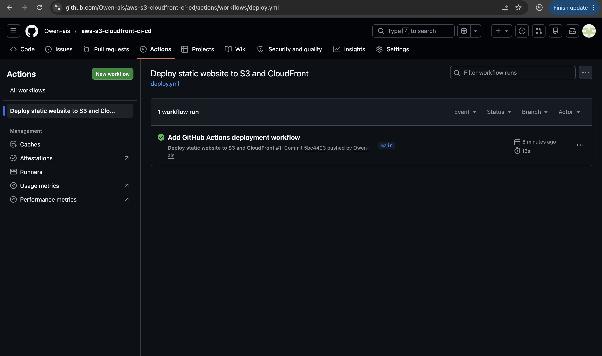
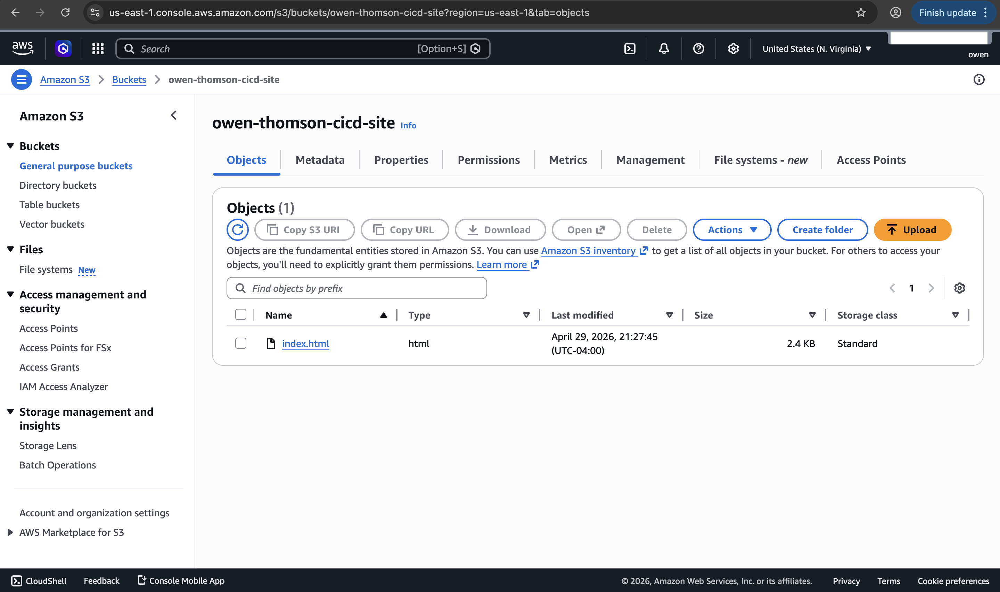
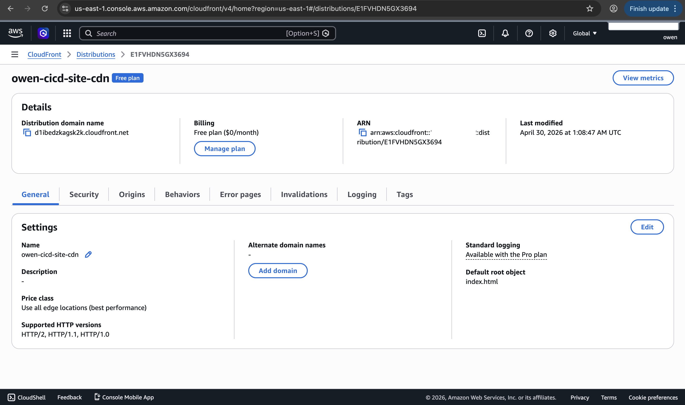
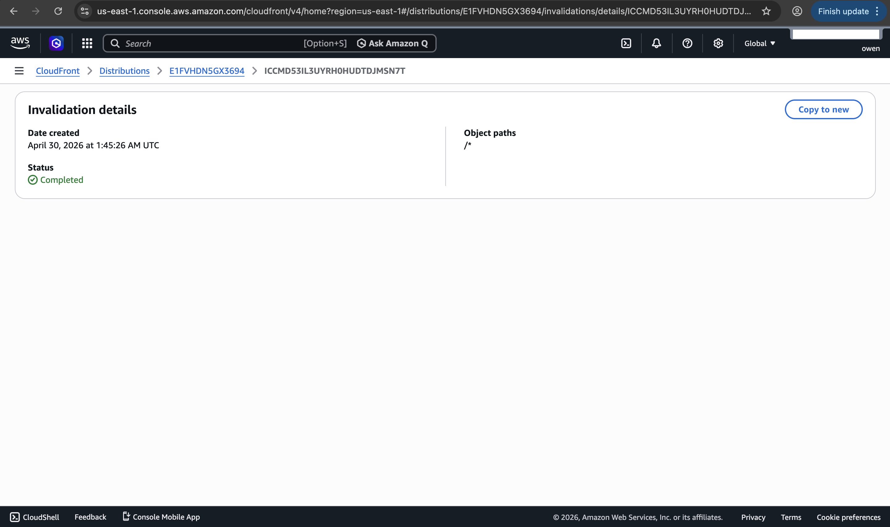
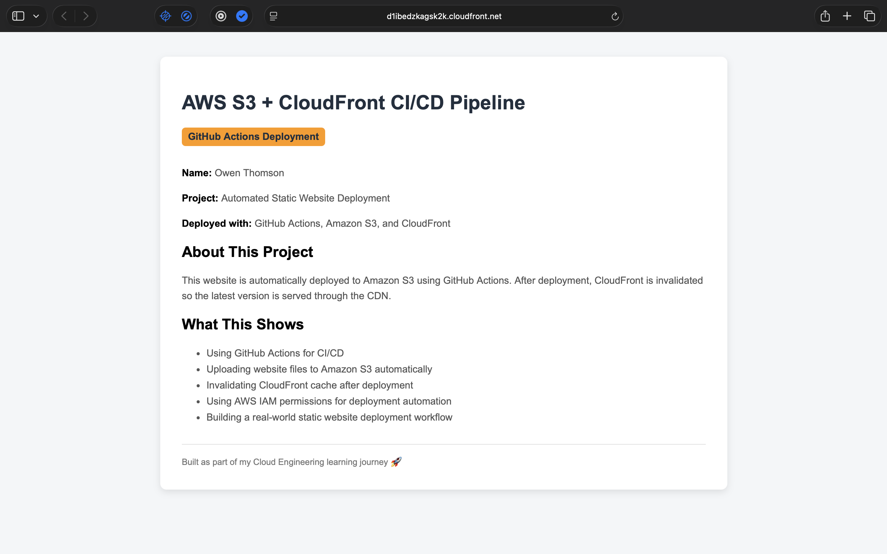

# AWS S3 + CloudFront CI/CD Pipeline

> CI/CD pipeline using GitHub Actions to automatically deploy a static website to Amazon S3 and invalidate Amazon CloudFront.

---

## Overview

This project demonstrates how to automate the deployment of a static website using **GitHub Actions**, **Amazon S3**, and **Amazon CloudFront**.

When changes are pushed to the `main` branch, GitHub Actions automatically uploads the latest website files to an S3 bucket and creates a CloudFront invalidation so the updated site is served through the CDN.

This project shows a real-world deployment workflow used for static websites, landing pages, documentation sites, and frontend applications.

---

## Architecture

- GitHub repository stores the website code
- GitHub Actions runs the deployment workflow
- Amazon S3 stores the static website files
- Amazon CloudFront delivers the website through a CDN
- CloudFront invalidation clears cached content after each deployment
- IAM role permissions allow GitHub Actions to deploy securely

---

## Technologies Used

- AWS S3
- Amazon CloudFront
- GitHub Actions
- AWS IAM
- OIDC authentication
- HTML
- CSS
- YAML

---

## Features

- Static website hosted in Amazon S3
- Website delivered through Amazon CloudFront
- Automated deployment using GitHub Actions
- CloudFront cache invalidation after deployment
- Private S3 bucket access through CloudFront
- IAM role-based deployment access
- No manual upload needed after the pipeline is configured

---

## How It Works

1. A static `index.html` website file was created.
2. An S3 bucket was created to store the website files.
3. A CloudFront distribution was created to deliver the website.
4. GitHub Actions was configured using a workflow file.
5. An IAM role was created for GitHub Actions deployment access.
6. Repository secrets were added for the S3 bucket, AWS region, role ARN, and CloudFront distribution ID.
7. When code is pushed to the `main` branch, GitHub Actions uploads the website files to S3.
8. GitHub Actions then creates a CloudFront invalidation so the latest version is served.

---

## GitHub Actions Workflow

The workflow is stored in:

```text
.github/workflows/deploy.yml
```

The workflow performs the following actions:

1. Checks out the GitHub repository
2. Configures AWS credentials using IAM role access
3. Syncs website files to the S3 bucket
4. Invalidates the CloudFront cache

---

## Screenshots

### GitHub Actions Successful Deployment



---

### S3 Deployed Website Files



---

### CloudFront Distribution



---

### CloudFront Invalidation



---

### Live CloudFront Website



---

## Project Files

```text
aws-s3-cloudfront-ci-cd/
├── README.md
├── index.html
├── .github/
│   └── workflows/
│       └── deploy.yml
└── Screenshots/
    ├── github-actions-success.png
    ├── s3-deployed-files.png
    ├── cloudfront-distribution.png
    ├── cloudfront-invalidation.png
    └── cloudfront-website-live.png
```

---

## What I Learned

- How to automate static website deployments using GitHub Actions
- How to upload files to Amazon S3 using a CI/CD pipeline
- How CloudFront caching works
- How to invalidate CloudFront cache after website updates
- How to use IAM permissions for deployment automation
- How to structure a simple real-world deployment workflow
- Why automation is useful for repeatable cloud deployments

---

## Why This Project Matters

This project demonstrates important cloud engineering skills including deployment automation, object storage, CDN delivery, IAM access control, and CI/CD workflows.

These are common skills used when deploying static websites, documentation pages, landing pages, and frontend applications in AWS.

---

## Status

Project completed successfully.

The website was deployed automatically using GitHub Actions, uploaded to Amazon S3, and served through Amazon CloudFront.
